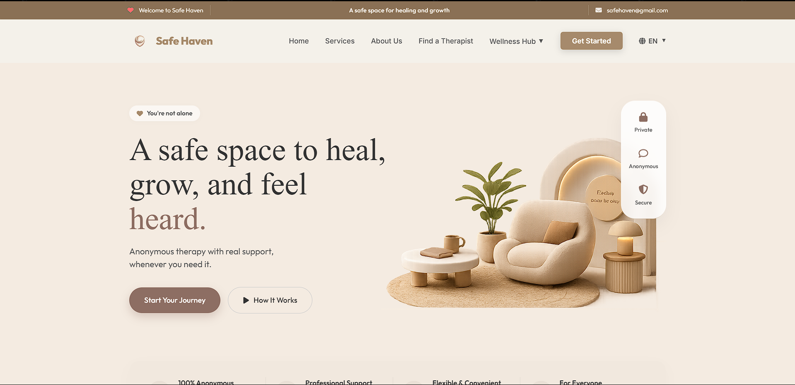
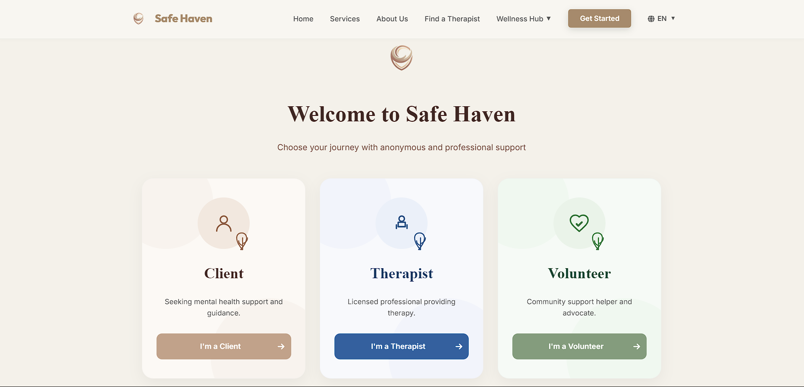
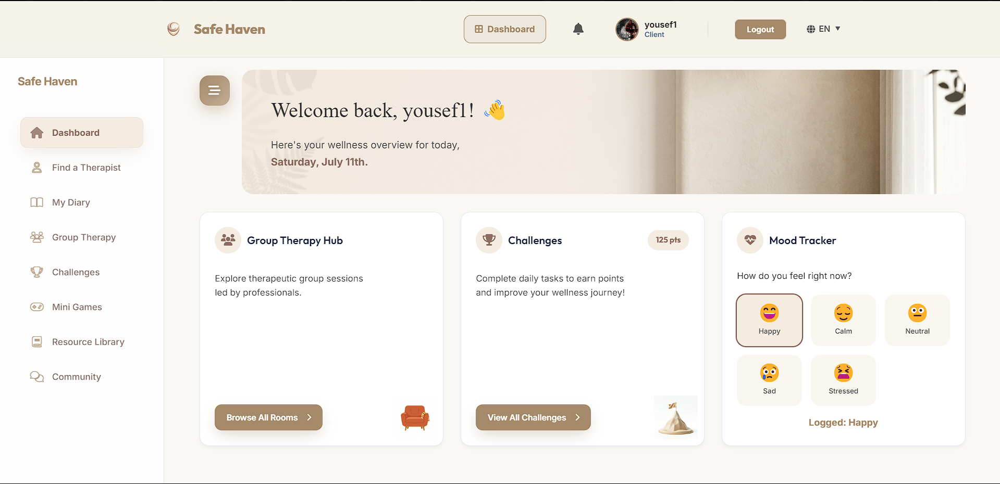
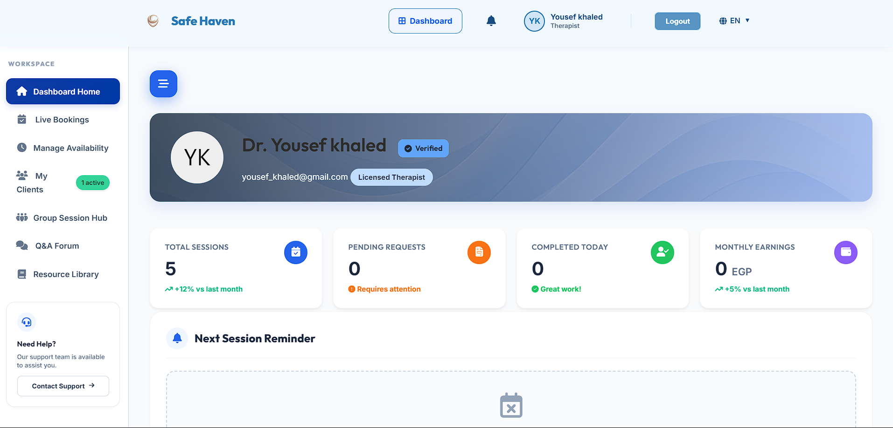
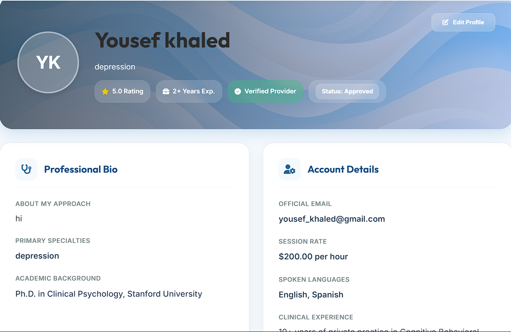

# 🛡️ SafeHaven - Anonymous Mental Health Support Platform

SafeHaven is a secure web-based mental health platform designed to provide **anonymous emotional support** by connecting clients with licensed therapists and trained volunteers. The platform focuses on privacy, accessibility, and creating a safe environment where users can seek support without revealing their identity.

---

# ✨ Features

## 👤 Client

- Anonymous registration and login
- Book therapy sessions
- Private messaging
- Community discussions
- Personal diary
- Wellness challenges
- Progress tracking
- Resource library
- Profile management

## 🩺 Therapist

- Manage availability
- Accept and manage bookings
- Conduct therapy sessions
- View client requests
- Dashboard with session statistics
- Professional profile management

## 🤝 Volunteer

- Community support
- Group therapy participation
- Community Q&A
- Profile management

## 🔐 Administrator

- Manage users
- Manage therapists
- Manage volunteers
- Monitor sessions
- Platform management

---

# 🛠️ Technologies Used

- PHP
- MySQL
- HTML5
- CSS3
- JavaScript
- Bootstrap
- AJAX
- XAMPP

---

# 📂 Project Structure

```text
SafeHaven/
│
├── admin/
├── api/
├── assets/
├── config/
├── db/
├── includes/
├── messages/
├── therapist/
├── volunteer/
├── views/
├── screenshots/
├── index.php
├── login.php
├── register.php
└── README.md
```

---

# 📸 Project Screenshots

## 🏠 Homepage



---

## 🎭 Role Selection



---

## 👤 Client Dashboard



---

## 🩺 Therapist Dashboard



---

## 👨‍⚕️ Therapist Profile



---

# 🚀 Installation

### Clone the repository

```bash
git clone https://github.com/yousefkhaled22h/anonymouses_therapy.git
```

### Move the project

Copy the project folder into:

```
xampp/htdocs/
```

### Create the database

Create a database named:

```
safehaven
```

### Import the SQL file

Import the database SQL file using phpMyAdmin.

### Configure the database

Update the database configuration if necessary.

### Start XAMPP

Start:

- Apache
- MySQL

Open:

```
http://localhost/test2/
```

---

# 👥 User Roles

- Client
- Therapist
- Volunteer
- Administrator

Each role has its own dashboard and permissions.

---

# 🔒 Security

- Password hashing
- Session authentication
- Role-based authorization
- Anonymous client identities
- Protected routes
- Input validation

---

# 🌱 Future Improvements

- AI-powered emotional support assistant
- Video consultation
- Mobile application
- Push notifications
- Payment gateway integration
- Multi-language support

---

# 🎯 Project Goal

SafeHaven aims to make mental health support more accessible by providing a secure and anonymous platform where individuals can connect with therapists, volunteers, and supportive communities while protecting their privacy.

---

# 👨‍💻 Authors

| Name | Role |
|------|------|
| **Yousef Khaled** | Full Stack Developer |
| **Hana Abdulkareem** | Full Stack Developer |

GitHub: https://github.com/yousefkhaled22h
GitHub: https://github.com/hanaabdulkareem
---

